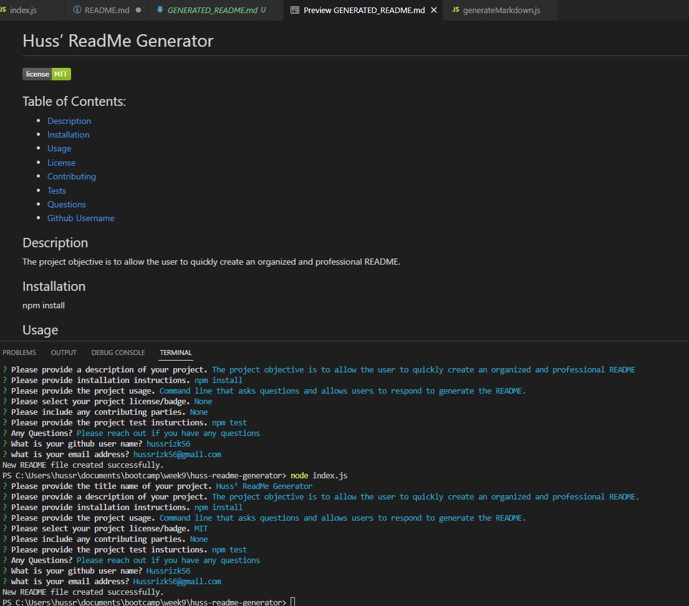

# Huss-ReadMe-Generator

For this week's assignment I created a command line application to generate an easy and professional README file. I utilized Node Modules (NPM), Inquirer and package.json. 

## Actions taken:
* Used Inquirer package to give the user with a series of questions via the command-line interface to answer to generator the readme.
* The user was provided with "list" prompt to allow them to select a license. 
* The "writefile" function was used to write the inputs onto the README. 
* The "init" function was used to initilize the application. 
* The licenseLink function was used so that the license selected will display as a badge on the read me (In the vidoe I did not include license but redid it with the MIT license). 
* The generate markdown function was used to display the inputted information in an organized and professional manner. 
 
## Screenshot:

 

## Links: 

Video Link: https://drive.google.com/file/d/185o8wWQs8Xh-G0ZiY0WZZCJ0MfpKpp6b/view

GitHub Link: https://github.com/hussrizk56/Huss-ReadMe-Generator
